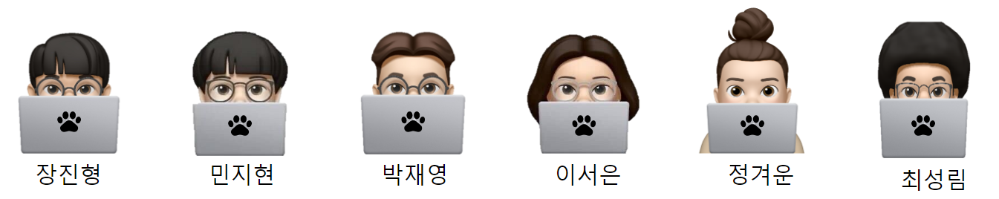
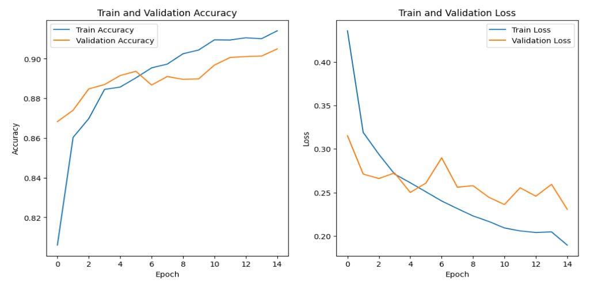
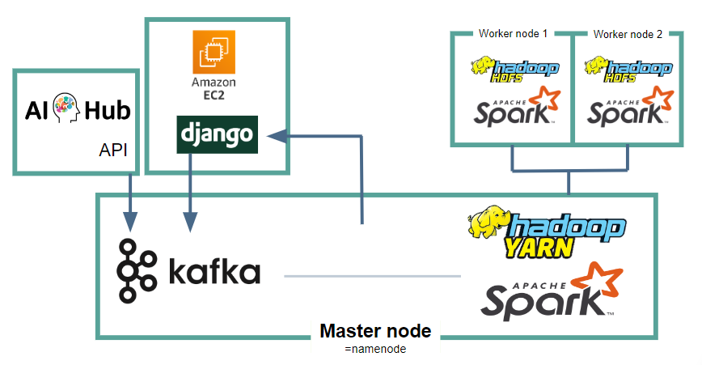

 Walness 

 

## 소개 및 기획 배경

1300만의 반려인을 위한 무료 반려동물 안구 질환 진단 서비스입니다.  
현재 대한민국의 약 25%에 해당하는 1300만 명이 반려동물을 키우는 반려인이고 이 비율은 꾸준히 상승하고 있습니다. 내 아이가 안 아프고 쭉 건강하게 잘 지내줬으면 하는 마음과는 달리 아프지 않기는 쉽지 않은 게 현실이죠. 게다가 아파서 동물 병원에 가게 된다면, 안 그래도 아파하는 반려동물 때문에 마음이 쓰이는데, 사람과 다르게 의료보험이 적용되지 않아서 금전적인 부담까지도 겪게 됩니다. 이러한 부담에 서있는 반려인을 돕기 위해, 반려동물의 안구 질환을 무료로 진단할 수 있는 서비스를 개발했습니다.

## 사용 방법

UX를 극대화하기 위해 심플하면서 편안한 디자인으로 구성했다.  
사용자는 처음 맞이하는 홈 화면에서 반려동물이 강아지인지 고양이인지 선택한다. 그리고 '파일 선택' 버튼을 클릭하여 반려동물의 눈 사진을 업로드한 후 '제출' 버튼을 누르면 진단 결과를 확인할 수 있다.

 

사용자가 받는 결과는 위의 사진과 같다. 사용자가 올린 이미지와 Grad CAM이 적용된 사진을 받는다. 질병 명칭과 예측 신뢰도도 확인할 수 있다. 또한, 질병에 대한 간략한 정보도 같이 제공 받을 수 있다.  
질병에 따라 병원을 추천하고, 사용자는 '주위의 동물 병원 찾기' 버튼을 눌러서 저희가 제공하는 동물 병원 추천 페이지로 이동할 수 있습니다.

 

동물 병원 추천 시스템은 구글지도를 기반으로 보여 준다. 사용자가 위치 정보 사용에 동의하면, 사용자의 위치와 함께 주변의 동물 병원들을 표시 한다.  
우측에는 동물병원을 거리 순 혹은 별점 순으로 정렬해서 보여주는 버튼이 있기 때문에, 사용자가 원하는 동물병원을 더 찾기 쉽게 했다.

 

▼ 시연 영상

 https://github.com/lim4373/walness/assets/114973162/27b9d33d-d971-43a7-938d-601fa15ecd11

 

## 팀 소개

## 사용 데이터

반려동물 안구질환 데이터  
제공: AI 허브  
https://aihub.or.kr/aihubdata/data/view.do?currMenu=115&topMenu=100&aihubDataSe=data&dataSetSn=562

 

## 모델 구성

결과값 반환시간과 모델의 정확도 사이에서 저울질하다가 Resnet50 단일 모델을 채택했다.  
모델은 사전 학습된 모델을 가져와서 Stage 1~4에 있는 컨볼루션 레이어에 trainable = False를 줬다.  
이 외에 Dense 레이어의 노드 수와 옵티마이저의 선택 그리고 그 외 하이퍼 파라미터들은 Optuna로 최적화했다.

 

## 기술 스택 

### Tensorflow - 팀원이 같이 할 수 있는 딥러닝 프레임워크를 채택.  
### Scikit-learn - 데이터 전처리에 사용.  
### OpenCV - 데이터 전처리에 사용.  
### Grad Cam - 모델 시각화에 사용.  
### Optuna - 하이퍼 파라미터 최적화에 사용.  
### Django - Python에 익숙한 전체 팀을 고려하여 Django를 웹 프레임워크로 채택.  
### JavaScript - 웹 페이지의 동적인 구현 및 Google Maps API를 적용하고, 지도 기반 기능을 개발하기 위해 사용.  
### Hadoop Ecosystem - Hadoop HDFS, Spark, Kafka를 이용해서 데이터 엔지니어링을 구현.  
### VSCode Dev Containers - 팀원과 개발환경을 맞추기 위해 사용.  

 

## 데이터 엔지니어링

